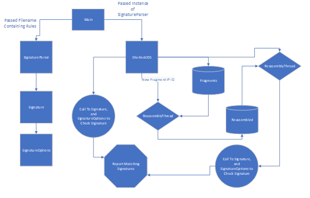
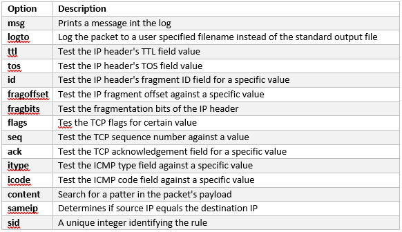

# Simple Intrusion Detection System

## By Christopher Cartagena

## Diagram Overview
  

## Details

The Sherlock IDS is built using Java.  It parses network packets according to the RFC's for Ethernet, ARP, IP, TCP, UDP, and ICMP.  Furthermore, an pre-processor has been added for fragmented packets, as well as for deep packet inspection

The available rules that Sherlock can currently detect are the following:



The format of rules is the following:

```
alert udp 129.244.125.194/24 4153 -> 129.244.73.185/24 61045 (msg: "possible teardrop attack detected, overlap in pre-processor"; sid:2; logto:teardropDetected.txt;)
```

For further documentation refer to the PDF report:  

[Sherlock Documentation](SherlockIDS/FinalReportProject3IDS.pdf)
